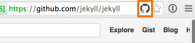

I often view a page on github and want to see the corresponding gh-page page on github.io
But often the page does not have a url.

this extension unintelligently shows an icon so I can easily switch back an forth.

It does not check that the branch exists. I'm sure that there is a way to detect this.
It also has my domain hardcoded. I plan on moving that out into preferences. but maybe tomorrow.

There is an extension labeled Github Pages Extension that looks more intelligent, but I wanted both way translation and could not get it to work. (assume html on github changed a bit)
